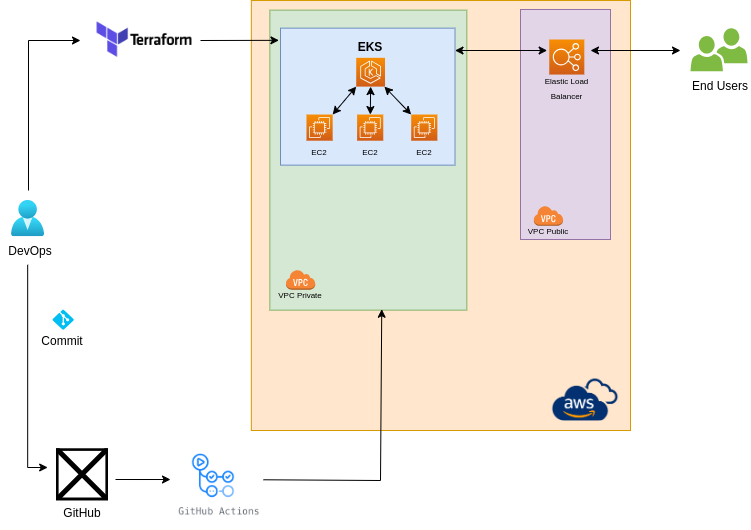

## 💡 Idea
In this process, the idea is to create a new EKS (Elastic Kubernetes Service) using Terraform as IaC (Infrastruture as a Code) with the code stored in GitHub, and use the GitHub Actions to deploy the EKS, and the TFState stored in S3.

---

### 🛠️ Worked with
+ [AWS](aws.amazon.com)
    + [S3](aws.amazon.com/s3)
    + [Elastic Kubernetes Service](aws.amazon.com/eks)
+ [Terraform](https://www.terraform.io)
   + [AWS Provider] (https://registry.terraform.io/providers/hashicorp/aws)
   + [AWS PVC Module] (https://registry.terraform.io/modules/terraform-aws-modules/vpc/aws)
   + [AWS EKS Module] (https://registry.terraform.io/modules/terraform-aws-modules/eks/aws)
   + [AWS EKS IAM Permission] (https://docs.aws.amazon.com/eks/latest/userguide/view-kubernetes-resources.html#view-kubernetes-resources-permissions)
+ [GitHub](https://www.github.com)
    + [GitHub-Actions](https://www.github.com/features/actions)
    + [GitHub-Actions-Marketplace](https://github.com/marketplace)
---

### 🚀 Process

1. Define the secrets in GitHub project:
 - `AWS_ACCESS_KEY_ID` = Based in the credentilas of AWS (CSV).
 - `AWS_SECRET_ACCESS_KEY` = Based in the credentilas of AWS (CSV).
 - `AWS_BUCKET_NAME` = This secret is the name of the bucket in S3.
 - `AWS_BUCKET_FILE` = This secret is the file on the bucket in S3, eg `my-state.tf`.

### ⌛ Testing the result

1. After the creation of EKS with Github Action, is posible to test the EKS with the commands
 - `aws eks update-kubeconfig --name eks` = Will get the Kubeconfig with the parameters of EKS.
 - `kubectl get nodes` = Check the number of the nodes created by the project.

### 📂 Diagram

